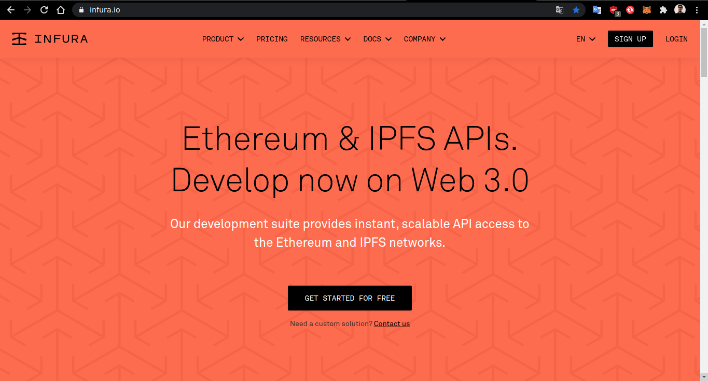
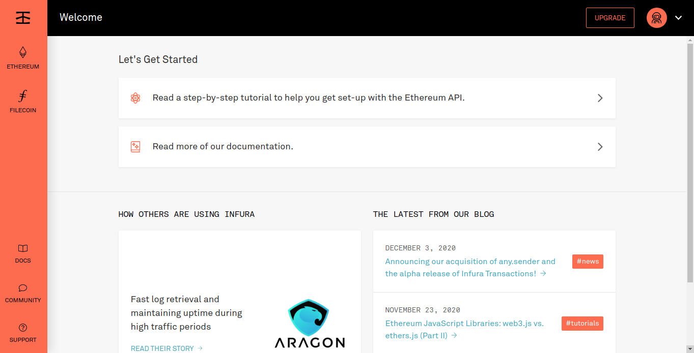
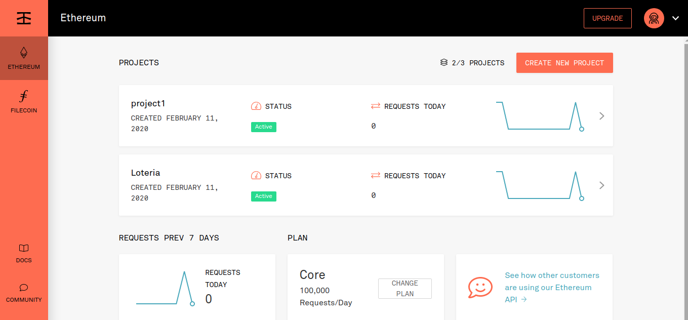
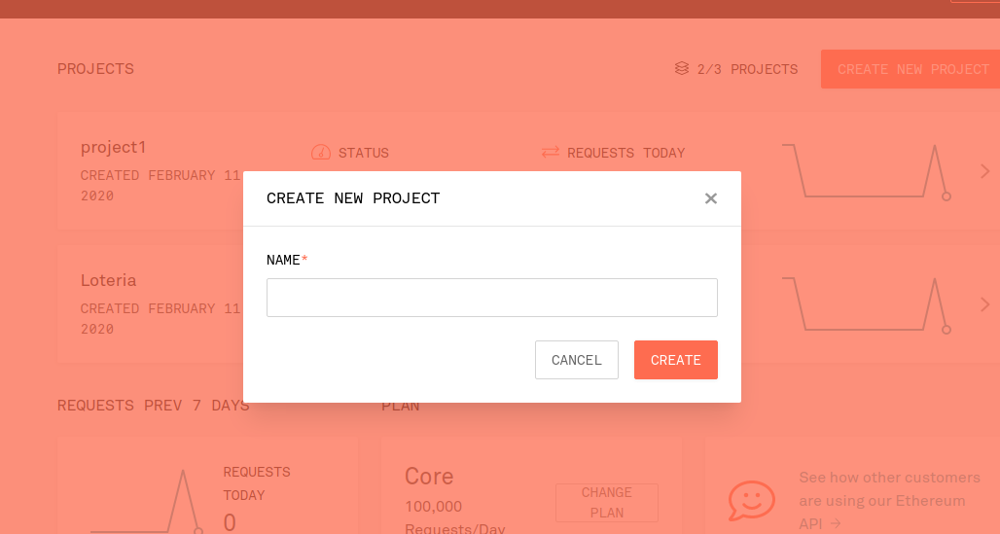
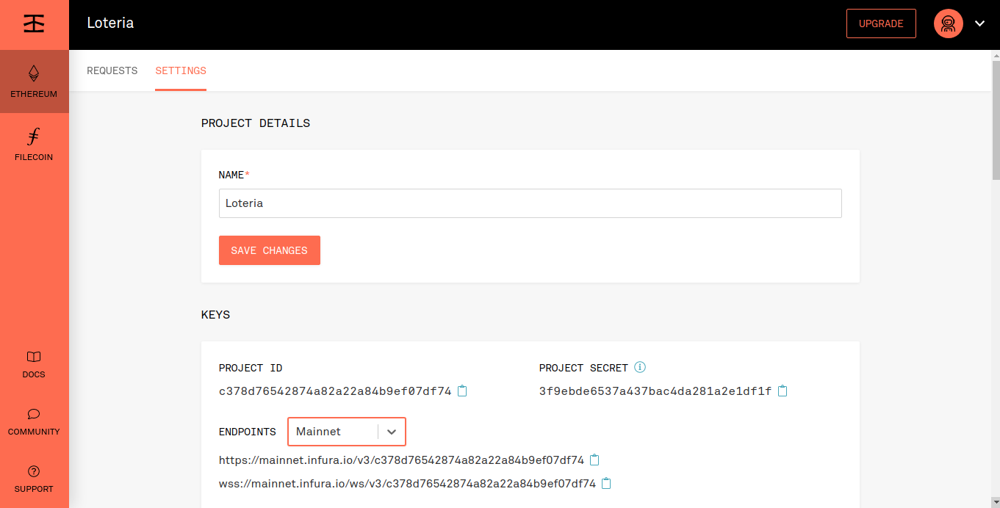
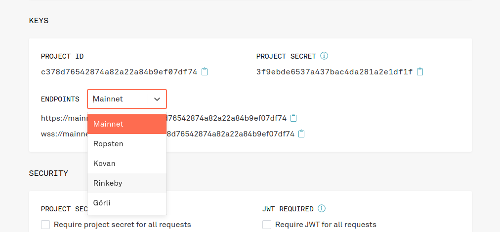
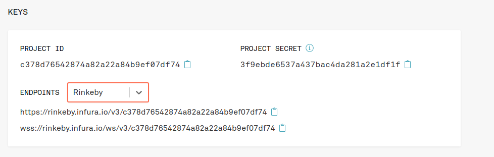

# Passo a passo de como rodar o contrato

1. [Rodando o projeto existente](https://github.com/lifuesc/minicurso-blockchain/tree/main/Praticas/loteria)
2. [Passo a passo](#passo-a-passo)

## Passo a passo

### Criando pasta

Crie um pasta para seu projeto e siga os passos:

```sh
# Cria Pasta
$ mkdir meu-projeto

# Entra na pasta
$ cd meu-projeto

# Cria package.json com configuração do projeto. Pode preencher ou apenas aperta Enter em tudo
$ npm init
```

#### Caso você vá usar git

Crie um arquivo chamado `.gitignore` e ponha esse conteúdo nele

```.gitignore
package-lock.json
yarn.lock
.env
.env.test
node_modules/
jspm_packages/
```

### Instalando módulos e ferramentas

Rode os seguintes comandos dentro da pasta criada acima

```sh
# Instala todos os pacotes que serão necessários
$ npm install --save @truffle/hdwallet-provider dotenv solc web3

# Instala dependencias de desenvolvimento
$ npm install --save ganache-cli mocha -D
```

### Criando o contrato

Crie uma pasta chamada `contracts` e dentro dela crie o arquivo `Loteria.sol` e depois o abra no editor de preferência.

Em seguida copie o seguinte contrato e depois salve o arquivo

```solidity
// SPDX-License-Identifier: MIT
pragma solidity ^0.7.4;

contract Loteria{
    address public gerente;
    // cria a variável para receber o endereço do gerente
    address payable[] public jogadores;
    // cria o array para reeber o endereço dos jogadores com capacidade de pagamento

    constructor(){
        gerente = msg.sender;
        //atribui o endereço do gerente à variável
    }

    function jogar() public payable{
        require(msg.value > 0.1 ether);
        jogadores.push(msg.sender);
        //adiciona no array o endereço do jogador
    }

    function random() private view returns (uint){
        return uint(keccak256(abi.encodePacked(block.difficulty, block.timestamp, jogadores)));
        // keccak256 gera um hash
    }

    function sorteio() public verificaGerente{
        uint indice = random() % jogadores.length;
        //usamos o operador modulo (%) para sortear um indice
        jogadores[indice].transfer(address(this).balance);
        jogadores = new address payable[](0);
    }

    modifier verificaGerente(){
        require(msg.sender == gerente);
        _;
    }

    function getJogadores() public view returns(address payable[] memory){
        return jogadores;
    }
}
```

### Criando o compile.js

Crie um arquivo chamado `compile.js` no raiz do projeto e adicione o seguinte código.

```js
const path = require("path"); // linhas para indicar o caminho onde o arquivo será lido
const fs = require("fs"); // e garantir a compatibilidade de sistemas operacionais
const solc = require("solc");

// Pega o arquivo Inbox.sol e atribui a variável
const LoteriaPath = path.resolve(__dirname, "contracts", "Loteria.sol");
const source = fs.readFileSync(LoteriaPath, "utf8");

// * Mais informações sobre o input e output
// * https://docs.soliditylang.org/en/v0.7.4/using-the-compiler.html#output-description
var input = {
  language: "Solidity",
  sources: {
    "Loteria.sol": {
      content: source,
    },
    // Pode-se adicionar outros contratos, caso exista
  },
  settings: {
    outputSelection: {
      "*": {
        "*": ["*"],
      },
    },
  },
};
let contratoCompilado = JSON.parse(solc.compile(JSON.stringify(input)));

// Gera o log para investigação
// console.log(contratoCompilado.contracts["Loteria.sol"].Loteria);

// Pedimos apenas o nosso contrato para exportação
module.exports = contratoCompilado.contracts["Loteria.sol"].Loteria;
```

### Criando o infura e .env

Para podermos seguirmos para os próximos passos será necessário criar um projeto no [Infura](infura.io). Caso não possua conta crie uma



No dashboard clique em `ETHEREUM`



Depois clique em `CREATE NEW PROJECT`



Ponha o nome do projeto como `Loteria` ou outro que desejar



Clique no projeto criado e vá em `SETTINGS` e depois em `KEYS`



Altere a rede de `MAINNET` para `RINKEBY`



Por fim copie o link https a baixo do `ENDPOINTS`



Uma vez configurado o infura crie um arquivo `.env` no raiz do projeto, cole esse conteúdo nele.

```.env
mnemonic = ''
provider = ''
```

Coloque o valor de suas palavras mnemonicas da carteira na variável `mnemonic` e o código que você copiou no infura no `provider`

### Criando arquivos de teste

Crie um apasta chamada `teste` e crie o arquivo `Loteria.test.js` e cole esse conteúdo:

```js
const assert = require("assert");
const ganache = require("ganache-cli");
const Web3 = require("web3");
const web3 = new Web3(ganache.provider());
const { abi, evm } = require("../compile");

let loteria;
let contas;

beforeEach(async () => {
  contas = await web3.eth.getAccounts();

  loteria = await new web3.eth.Contract(abi)
    .deploy({ data: evm.bytecode.object })
    .send({ from: contas[0], gas: "1000000" });
});
describe("Contrato Loteria", () => {
  it("Deploy a contract", () => {
    // console.log(inbox);
    assert.ok(loteria.options.address);
  });
  it("Permite que uma conta seja adicionada", async () => {
    await loteria.methods.jogar().send({
      from: contas[0],
      value: web3.utils.toWei("0.2", "ether"),
    });

    const jogadores = await loteria.methods.getJogadores().call({
      from: contas[0],
    });

    assert.strictEqual(contas[0], jogadores[0]);

    assert.strictEqual(1, jogadores.length);
  });
  it("Permite que varias contas sejam adicionadas", async () => {
    await loteria.methods.jogar().send({
      from: contas[0],
      value: web3.utils.toWei("0.2", "ether"),
    });
    await loteria.methods.jogar().send({
      from: contas[1],
      value: web3.utils.toWei("0.2", "ether"),
    });
    await loteria.methods.jogar().send({
      from: contas[2],
      value: web3.utils.toWei("0.2", "ether"),
    });

    const jogadores = await loteria.methods.getJogadores().call({
      from: contas[0],
    });

    assert.strictEqual(contas[0], jogadores[0]);
    assert.strictEqual(contas[1], jogadores[1]);
    assert.strictEqual(contas[2], jogadores[2]);

    assert.strictEqual(3, jogadores.length);
  });
  it("Verificando a quantidade mínima de ether", async () => {
    try {
      await loteria.methods.jogar().send({
        from: contas[0],
        value: 0,
      });

      assert(false);
    } catch (err) {
      assert.ok(err);
    }
  });
  it("Somente o gerente pode fazer o sorteio", async () => {
    try {
      await loteria.methods.sorteio().send({
        from: contas[1],
      });

      assert(false);
    } catch (err) {
      assert.ok(err);
    }
  });
  it("Testando o contrato como um todo", async () => {
    await loteria.methods.jogar().send({
      from: contas[0],
      value: web3.utils.toWei("2", "ether"),
    });

    const saldoInicial = await web3.eth.getBalance(contas[0]);

    await loteria.methods.sorteio().send({ from: contas[0] });

    const saldoFinal = await web3.eth.getBalance(contas[0]);

    const diferenca = saldoFinal - saldoInicial;

    assert(diferenca > web3.utils.toWei("1.8", "ether"));
  });
});
```

### Criando arquivo de compile

Crie um arquivo chamado `compile.js` no raiz do seu projeto e cole o seguinte código

```js
const path = require("path"); // linhas para indicar o caminho onde o arquivo será lido
const fs = require("fs"); // e garantir a compatibilidade de sistemas operacionais
const solc = require("solc");

// Pega o arquivo Inbox.sol e atribui a variável
const LoteriaPath = path.resolve(__dirname, "contracts", "Loteria.sol");
const source = fs.readFileSync(LoteriaPath, "utf8");

// * Mais informações sobre o input e output
// * https://docs.soliditylang.org/en/v0.7.4/using-the-compiler.html#output-description
var input = {
  language: "Solidity",
  sources: {
    "Loteria.sol": {
      content: source,
    },
    // Pode-se adicionar otros contratos, caso exista
  },
  settings: {
    outputSelection: {
      "*": {
        "*": ["*"],
      },
    },
  },
};
let contratoCompilado = JSON.parse(solc.compile(JSON.stringify(input)));

// Gera o log para investigação
// console.log(contratoCompilado.contracts["Loteria.sol"].Loteria);

// Pedimos apenas o nosso contrato para exportação
module.exports = contratoCompilado.contracts["Loteria.sol"].Loteria;
```

### Rodando testes

```sh
$ npm test

```

### Realizando o deploy do contrato

```sh
$ node deploy.js
```
