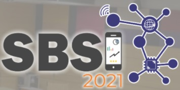

[![Contributors][contributors-shield]][contributors-url]
[![Forks][forks-shield]][forks-url]
[![Stargazers][stars-shield]][stars-url]
[![Issues][issues-shield]][issues-url]
[![MIT License][license-shield]][license-url]

 

  

  <h2 align="center">Minicurso Blockchain, Contratos Inteligentes e Sistemas Web: Teoria e Prática</h2>

  <h2 align="center">
    Simpósio Brasileiro de Sistemas de Informação
     
 
  </h2>

Autores

- Jauberth W. Abijaude (UESC)
- Fabíola Greve (UFBA)
- Pérciles de Lima Sobreira (University of Quebec Outaouais)
- Levy Santiago Mestrando em Ciência da Computação pela UFBA
- Henrique Serra Graduando em Ciência da Computação pela UESC

Resumo:
A blockchain é uma tecnologia disruptiva que oferece uma rede de confiança digital para a realização de transações entre pares. Os contratos inteligentes são códigos hospedados na blokchain e que estabelecem cláusulas contratuais a serem seguidas. Neste minicurso, apresentaremos os conceitos fundamentais, os mecanismos e as plataformas utilizadas por estas tecnologias, de forma a desenvolver em seus participantes as competências necessárias à implementação de aplicações Web confiáveis. Para isto, iremos demonstrar, através de exercícios práticos, um modelo de implementação de contratos inteligentes interagindo com sistemas Web, além de discutirmos os avanços, as oportunidades e os desafios em pesquisas relacionadas à esta área do conhecimento.

Índice

1. [Tutoriais de Ferramentas](https://github.com/lifuesc/minicurso-blockchain/tree/main/Ferramentas/)
   - [MetaMask](https://github.com/lifuesc/minicurso-blockchain/tree/main/Ferramentas/metamask)
   - [NodeJs](https://github.com/lifuesc/minicurso-blockchain/tree/main/Ferramentas/node)
   - [React](https://github.com/lifuesc/minicurso-blockchain/tree/main/Ferramentas/reactjs)
2. [Código Práticas](https://github.com/lifuesc/minicurso-blockchain/tree/main/Praticas)
   - [Smart Contract Test](https://github.com/lifuesc/minicurso-blockchain/tree/main/Praticas/smart-contract-test)
   - [Loteria](https://github.com/lifuesc/minicurso-blockchain/tree/main/Praticas/loteria)
   - [Loteria ReactJs](https://github.com/lifuesc/minicurso-blockchain/tree/main/Praticas/loteria-react)

[contributors-shield]: https://img.shields.io/github/contributors/lifuesc/minicurso-blockchain.svg?style=for-the-badge
[contributors-url]: https://github.com/lifuesc/minicurso-blockchain/graphs/contributors
[forks-shield]: https://img.shields.io/github/forks/lifuesc/minicurso-blockchain.svg?style=for-the-badge
[forks-url]: https://github.com/lifuesc/minicurso-blockchain/network/members
[stars-shield]: https://img.shields.io/github/stars/lifuesc/minicurso-blockchain.svg?style=for-the-badge
[stars-url]: https://github.com/lifuesc/minicurso-blockchain/stargazers
[issues-shield]: https://img.shields.io/github/issues/lifuesc/minicurso-blockchain.svg?style=for-the-badge
[issues-url]: https://github.com/lifuesc/minicurso-blockchain/issues
[license-shield]: https://img.shields.io/github/license/lifuesc/minicurso-blockchain.svg?style=for-the-badge
[license-url]: https://github.com/lifuesc/minicurso-blockchain/blob/main/LICENSE
